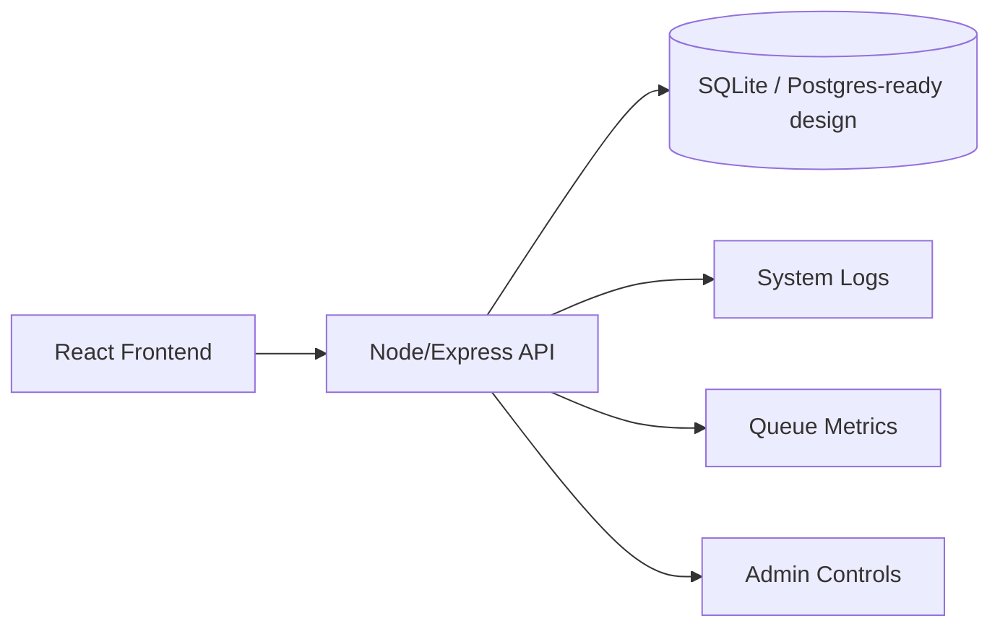

# NotifyFlow

Production-style event-driven notification platform with:
- Role-based auth (`user` + `admin`)
- Live dashboard panels (events, notifications, queue, workers, analytics)
- Admin control center (user management, system broadcast, logs, export logs)
- Demo mode sandbox

## Screenshots
- `docs/screenshots/landing.png` (add)
- `docs/screenshots/dashboard.png` (add)
- `docs/screenshots/admin.png` (add)

## Architecture Diagram


## Why This Project
NotifyFlow was built to simulate how a real SaaS operations dashboard behaves:
- fast demo onboarding for reviewers
- persistent user-backed activity for registered users
- production-style admin controls and observability

## Features
- Landing page at `/` with Hero, Features, Architecture placeholder, and CTA
- Auth + roles:
  - first registered account becomes `admin`
  - later accounts default to `user`
  - server-side route checks for auth/admin endpoints
- Event dashboard:
  - live event log
  - recent notifications
  - worker instances
  - analytics chart
  - queue + system stats
  - websocket/live status indicator in navbar
- Admin dashboard:
  - users table: email, role, created date, total notifications sent, last active
  - actions: promote/demote, deactivate/activate, delete user
  - overall stats: total users, events today, queue depth, system health
  - system logs panel
  - export logs as JSON
- Demo sandbox mode:
  - in-memory temporary session
  - simulated activity without touching real DB

## Tech Stack
- Frontend: React + React Router + Tailwind utility classes + Lucide icons
- Backend: Node.js + Express
- Data: SQLite (default local/deploy quickstart)
- Auth model: server-validated role checks on protected endpoints

## Local Run
### 1) Backend
```bash
cd backend
npm install
npm run seed
npm run dev
```
Backend env vars (optional): copy `backend/.env.example` to `.env`.

### 2) Frontend
```bash
cd event
npm install
npm start
```
Frontend env vars: copy `event/.env.example` to `.env`.

### Demo + Seed Accounts
- Demo button: from landing page
- Seed admin:
  - `admin@notifyflow.com`
  - `password123`

## Deployment
### Frontend (Vercel)
1. Import `event` directory as project
2. Build command: `npm run build`
3. Output directory: `build`
4. Set env: `REACT_APP_API_URL=https://<your-backend-domain>`
5. `event/vercel.json` already includes SPA rewrites

### Backend (Render)
1. Import `backend` directory
2. Use `backend/render.yaml` or configure manually:
   - Build: `npm install`
   - Start: `npm start`
3. Set env:
   - `FRONTEND_URL=https://<your-vercel-domain>`
   - `PORT=4000`

### Backend (Railway)
1. Import `backend`
2. `backend/railway.json` provides start command
3. Set env:
   - `FRONTEND_URL=https://<your-vercel-domain>`

## PostgreSQL Note
Current runtime uses SQLite for quick setup and seeded demo readiness.  
For managed Postgres (Railway/Supabase), swap DB adapter in `backend/db.js` and migrate SQL queries.

## Scripts
### Backend
- `npm run dev` - watch mode
- `npm start` - production start
- `npm run seed` - reset and prepopulate DB

### Frontend
- `npm start`
- `npm run build`

